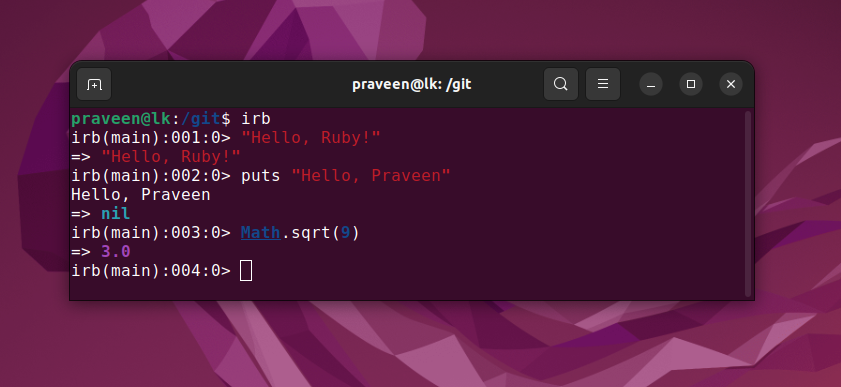
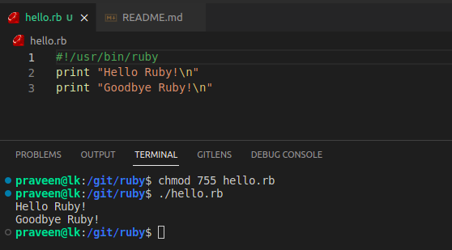
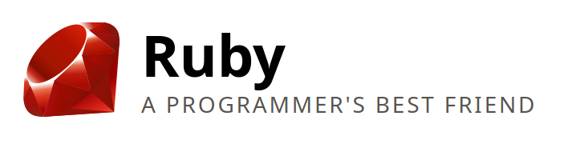

# Ruby

Ruby was developed in the mid-1990s by Yukihiro "Matz" Matsumoto in Japan.


A dynamic, open source programming language with a focus on simplicity and productivity. It has an elegant syntax that is natural to read and easy to write.

https://www.ruby-lang.org/en/



# Ruby Scripting



# Duck Typing

```ruby
puts "Goodbye #{@names.join(", ")}.  Come back soon!"
```

Checks to see if @names responds to the join method, and if so, uses it. Otherwise, it just prints out the variable as a string. This method of not caring about the actual type of a variable, just relying on what methods it supports is known as “Duck Typing”, as in “if it walks like a duck and quacks like a duck…”. The benefit of this is that it doesn’t unnecessarily restrict the types of variables that are supported. If someone comes up with a new kind of list class, as long as it implements the join method with the same semantics as other lists, everything will work as planned.

# Best Friend

